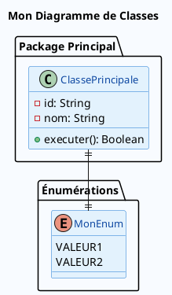

# 📐 Structure Standardisée des Diagrammes de Classes KYC

## 🎯 Vue d'ensemble

Tous les diagrammes de classes du projet KYC suivent une structure standardisée pour garantir :
- **Cohérence visuelle** sur l'ensemble du projet
- **Lisibilité optimale** des diagrammes
- **Maintenance simplifiée** du code PlantUML

## 🎨 Structure Standard

### 1. **Configuration des Couleurs**
```plantuml
@startuml NomDuDiagramme
skinparam linetype polyline
skinparam backgroundColor #F8FBFF
skinparam classBackgroundColor #E3F2FD    ← BLEU CLAIR OBLIGATOIRE
skinparam classBorderColor #1976D2
skinparam classFontColor #0D47A1
skinparam classFontSize 13
skinparam classAttributeFontSize 12
skinparam classMethodFontSize 12
skinparam classAttributeIconSize 0
skinparam shadowing true
skinparam roundCorner 15
skinparam nodesep 40
skinparam ranksep 30
```

### 2. **Définition des Packages (SANS couleur)**
```plantuml
package "Nom du Package" {           ← PAS de couleur (#XXXXXX)
  class MaClasse {
    - attribut: String
    + methode(): Boolean
  }
}
```

### 3. **Exemple Complet**


## 📂 Fichiers Concernés

### Répertoire Principal
- `KYC ENTREE_EN_RELATION/DIAGRAMMES-CLASSE/`
  - ✅ `00_VueEnsembleArchitecture.puml`
  - ✅ `01_GestionWorkflow.puml`
  - ✅ `02_ControlesReglementaires.puml`
  - ✅ `03_GestionDocuments.puml`
  - ✅ `04_AgentsEtUnites.puml`
  - ✅ `05_ClientEtDonnees.puml`
  - ✅ `WorkflowOuvertureCompte.puml`

### Version Française
- `KYC DIAGRAMME DE CLASSE/DiagrammeClasse*/`
  - ✅ Tous les fichiers standardisés

### Version Anglaise
- `KYC-ENGLISH-VERSION/KYC CLASS DIAGRAMS/`
- `KYC-ENGLISH-VERSION/ACCOUNT-OPENING-SYSTEM/CLASS-DIAGRAMS/`
  - ✅ Tous les fichiers standardisés

## 🛠️ Outils de Maintenance

### Script de Vérification
```bash
./verifier_structure_classes.sh
```
Vérifie que tous les diagrammes respectent la structure standard.

### Script de Standardisation
```bash
./standardiser_diagramme_classe.sh fichier.puml
```
Applique automatiquement la structure standard à un fichier.

### Template Standard
Utilisez `TEMPLATE_STANDARD_CLASSE.puml` comme base pour tout nouveau diagramme.

## 🚫 Ce qu'il NE faut PAS faire

❌ **Couleurs de fond sur les packages**
```plantuml
package "Mon Package" #E8F5E8 {    ← INTERDIT
```

❌ **Fond vert pour les classes**
```plantuml
skinparam classBackgroundColor #E8F5E8    ← INTERDIT
```

❌ **Couleurs incohérentes**
```plantuml
skinparam classBackgroundColor #FF0000    ← INTERDIT
```

## ✅ Ce qu'il FAUT faire

✅ **Fond bleu pour les classes**
```plantuml
skinparam classBackgroundColor #E3F2FD    ← OBLIGATOIRE
```

✅ **Packages sans couleur**
```plantuml
package "Mon Package" {    ← CORRECT
```

✅ **Structure complète standard**
Toujours utiliser le template ou copier la configuration depuis un fichier existant.

## 🎯 Avantages de cette Structure

1. **Cohérence Visuelle**
   - Tous les diagrammes ont le même aspect
   - Navigation intuitive entre les diagrammes

2. **Lisibilité Optimisée**
   - Fond bleu clair non agressif pour les yeux
   - Contraste optimal pour le texte

3. **Maintenance Simplifiée**
   - Structure prévisible
   - Scripts d'automatisation disponibles

4. **Professionnalisme**
   - Aspect uniforme et soigné
   - Facilite la présentation et la documentation

## 📅 Historique

- **2025-06-17** : Standardisation complète de tous les diagrammes de classes
- **2025-06-17** : Création des scripts de maintenance et de vérification
- **2025-06-17** : Documentation de la structure standard

---

**🔧 Maintenance** : Cette structure doit être respectée pour tous les nouveaux diagrammes de classes ajoutés au projet.
