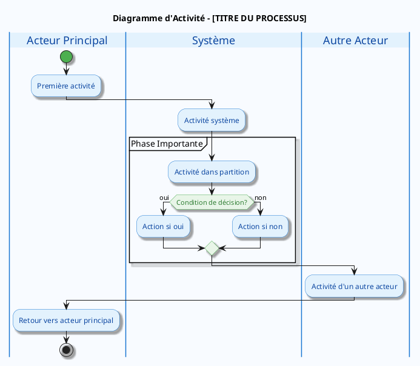

# Template Standard pour Diagrammes d'Activité

## 📋 Template PlantUML - Diagramme d'Activité avec Couloirs



## 🎨 Éléments du Template

### 1. **Configuration de Style (Material Design)**
- **Couleur de fond** : `#F8FBFF` (bleu très clair)
- **Activités** : `#E3F2FD` (bleu clair)
- **Bordures** : `#1976D2` (bleu foncé)
- **Décisions** : `#E8F5E8` (vert clair)
- **Start/Stop** : Vert/Rouge

### 2. **Structure des Couloirs**
```plantuml
|Nom du Couloir|
:Activité dans ce couloir;

|Autre Couloir|
:Activité dans l'autre couloir;
```

### 3. **Acteurs Types Recommandés**
- `|Client|` - Pour les actions du client
- `|Système|` - Pour les traitements automatiques
- `|Agent Commercial|` - Pour les actions des agents
- `|Service [Nom]|` - Pour les services spécialisés
- `|Responsable|` - Pour les validations hiérarchiques
- `|Direction Générale|` - Pour les délégations

### 4. **Partitions Recommandées**
```plantuml
partition "Nom de la Phase" {
    :Activité 1;
    :Activité 2;
}
```

### 5. **Structures de Décision**
```plantuml
if (Question de décision?) then (oui)
    :Action si condition vraie;
else (non)
    :Action si condition fausse;
endif
```

## 📐 Règles de Nommage

### Fichiers
- Format : `##_NomDuProcessus.puml`
- Exemple : `01_ProcessusGlobal.puml`

### Couloirs
- Noms clairs et métier
- Pas de couleurs de fond (style uniforme)
- Séparation logique des responsabilités

### Activités
- Verbes d'action à l'infinitif
- Maximum 3 lignes par activité
- Langage métier compréhensible

## 🔧 Scripts Utiles

### Génération PNG
```bash
plantuml *.puml
```

### Vérification Couloirs
```bash
grep -c "^|" *.puml
```

### Validation Syntaxe
```bash
plantuml -checkonly *.puml
```

## ✅ Checklist Qualité

- [ ] Titre explicite et métier
- [ ] Couloirs avec responsabilités claires
- [ ] Start et stop bien placés
- [ ] Décisions avec conditions explicites
- [ ] Partitions pour les phases importantes
- [ ] Style Material Design appliqué
- [ ] PNG généré sans erreur
- [ ] Documentation du processus

## 📝 Exemple d'Usage

1. **Copier le template**
2. **Remplacer** `NomDuDiagramme` et le titre
3. **Ajouter les couloirs** selon les acteurs
4. **Structurer les activités** avec partitions
5. **Tester la génération** PNG
6. **Documenter** le processus

---
**Template validé** : 16 juin 2025
**Utilisation** : Tous futurs diagrammes d'activité du projet
