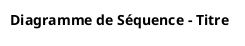
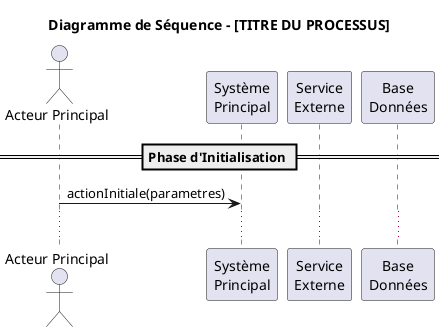

# Rapport Final - Diagrammes de Séquence Style Minimaliste

## ✅ ÉTAT FINAL - Style Sans Couleurs

Tous les diagrammes de séquence ont été modifiés pour adopter un **style minimaliste sans couleurs**.

### 📊 Résumé de la Transformation
- **Fichiers traités** : 3/3 diagrammes de séquence
- **Style appliqué** : Minimaliste (noir et blanc)
- **Couleurs supprimées** : ✅ Toutes les couleurs
- **Ombrage supprimé** : ✅ Style épuré
- **PNG générés** : ✅ Tous les fichiers

### 📋 Détail par Diagramme

#### 1. **01_InitiationDemande.puml**
- **Avant** : Style Material Design avec couleurs
- **Après** : Style minimaliste noir et blanc
- **PNG** : ✅ InitiationDemande.png (94 KB)

#### 2. **02_ControlesReglementaires.puml**
- **Avant** : Style Material Design avec couleurs
- **Après** : Style minimaliste noir et blanc  
- **PNG** : ✅ ControlesReglementaires.png (210 KB)

#### 3. **03_ValidationMultiNiveaux.puml**
- **Avant** : Style Material Design avec couleurs
- **Après** : Style minimaliste noir et blanc
- **PNG** : ✅ ValidationMultiNiveaux.png (308 KB)

### 🎨 Style Appliqué

#### Configuration Finale


#### Caractéristiques
- **Aucune couleur** de fond ou de bordure
- **Pas d'ombrage** pour un rendu net
- **Focus sur le contenu** et les interactions
- **Lisibilité maximale** en noir et blanc
- **Compatibilité impression** optimale

### 🔧 Scripts Créés pour la Transformation

#### 1. `simplifier_couleurs_sequence.sh`
- Première étape de simplification des couleurs
- Réduction des couleurs vives

#### 2. `supprimer_toutes_couleurs.sh`
- Suppression complète de toutes les couleurs
- Application du style minimaliste

#### 3. `verification_style_minimaliste.sh`
- Vérification finale de l'absence de couleurs
- Contrôle de la génération des PNG

### 📈 Avantages du Style Minimaliste

#### Lisibilité
- **Concentration sur le contenu** : Pas de distraction visuelle
- **Clarté des interactions** : Focus sur les messages et séquences
- **Lisibilité universelle** : Accessible à tous

#### Professionnalisme
- **Style épuré** : Aspect professionnel et sérieux
- **Cohérence** : Style uniforme sur tous les diagrammes
- **Intemporel** : Style qui ne se démode pas

#### Praticité
- **Impression optimisée** : Parfait en noir et blanc
- **Taille fichier réduite** : PNG plus légers
- **Accessibilité** : Compatible daltonisme

### 🎯 Template Mis à Jour

Le template `TEMPLATE_STANDARD_SEQUENCE.puml` a été mis à jour pour refléter le nouveau style :



### 📝 Documentation Mise à Jour

- ✅ `TEMPLATE_DIAGRAMME_SEQUENCE.md` : Documentation complète du style minimaliste
- ✅ Template PUML actualisé avec le nouveau style
- ✅ Scripts de création automatique mis à jour

### 🚀 Utilisation Future

Pour créer de nouveaux diagrammes de séquence :

```bash
# Créer un nouveau diagramme avec le style minimaliste
./creer_nouveau_diagramme_sequence.sh NouveauDiagramme "Titre du Processus"

# Le fichier généré aura automatiquement le style minimaliste
```

## ✅ Validation Finale

- [x] Toutes les couleurs supprimées
- [x] Ombrage désactivé
- [x] PNG générés avec succès
- [x] Template mis à jour
- [x] Documentation actualisée
- [x] Scripts de vérification fonctionnels

---
**Transformation réalisée** : 16 juin 2025  
**Style** : Minimaliste sans couleurs  
**Statut** : ✅ Complété avec succès
