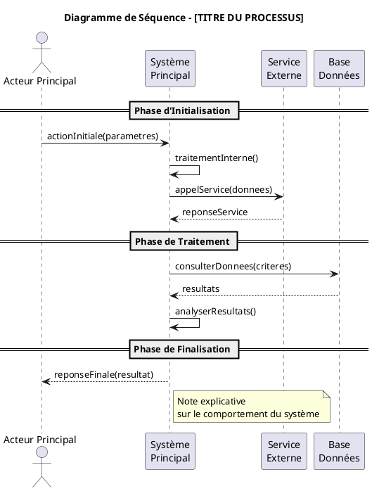

# Template Standard pour Diagrammes de Séquence

## 📋 Template PlantUML - Diagramme de Séquence



## 🎨 Éléments du Template

### 1. **Style Minimaliste**
- **Aucune couleur** : Style noir et blanc épuré
- **Ombrage désactivé** : Pour un rendu plus net
- **Focus sur le contenu** : Lisibilité maximale

### 2. **Structure des Participants**
```plantuml
actor "Nom Acteur" as Alias
participant "Nom\nParticipant" as Alias
```

### 3. **Types de Participants Recommandés**
- `actor Client` - Pour les utilisateurs finaux
- `participant "Agent\nCommercial" as Agent` - Pour les agents
- `participant "Système\nPrincipal" as Systeme` - Pour le système central
- `participant "Service\nExterne" as Service` - Pour les services
- `participant "Base\nDonnées" as BDD` - Pour les bases de données

### 4. **Phases avec Séparateurs**
```plantuml
== Nom de la Phase ==
Participant1 -> Participant2 : message
```

### 5. **Types de Messages**
```plantuml
A -> B : appel synchrone
A ->> B : appel asynchrone
A --> B : réponse
A -> A : auto-appel
```

### 6. **Notes Explicatives**
```plantuml
note right of Participant
  Explication du comportement
  ou de la logique métier
end note
```

## 📐 Règles de Nommage

### Fichiers
- Format : `##_NomDuProcessus.puml`
- Exemple : `01_InitiationDemande.puml`

### Participants
- Noms métier compréhensibles
- Alias courts pour faciliter l'écriture
- Séparation sur 2 lignes si nécessaire

### Messages
- Verbes d'action en camelCase
- Paramètres entre parenthèses
- Noms explicites et métier

## 🔧 Phases Standards Recommandées

### Pour Processus d'Ouverture de Compte
```plantuml
== Authentification ==
== Création de la Demande ==
== Validation des Données ==
== Configuration du Workflow ==
== Notification et Suivi ==
== Logging ==
```

### Pour Processus de Validation
```plantuml
== Réception de la Demande ==
== Contrôles Automatiques ==
== Validation Manuelle ==
== Décision Finale ==
== Notification Résultat ==
```

## 🎯 Bonnes Pratiques

### Structure
1. **Phases logiques** avec séparateurs `==`
2. **Messages métier** compréhensibles
3. **Auto-appels** pour traitements internes
4. **Notes** pour explications importantes
5. **Réponses** systématiques aux appels

### Style
- **Couleurs cohérentes** avec Material Design
- **Alias courts** pour lisibilité
- **Noms explicites** pour participants
- **Phases nommées** clairement

## ✅ Checklist Qualité

- [ ] Titre explicite et métier
- [ ] Participants avec rôles clairs
- [ ] Phases logiques bien séparées
- [ ] Messages avec verbes d'action
- [ ] Réponses pour tous les appels
- [ ] Notes pour logique complexe
- [ ] Style Material Design appliqué
- [ ] PNG généré sans erreur

## 📝 Exemple d'Usage

1. **Copier le template**
2. **Remplacer** `NomDuDiagramme` et le titre
3. **Définir les participants** selon les acteurs
4. **Structurer en phases** logiques
5. **Ajouter les messages** métier
6. **Tester la génération** PNG
7. **Documenter** les interactions

---
**Template validé** : 16 juin 2025
**Utilisation** : Tous futurs diagrammes de séquence du projet
